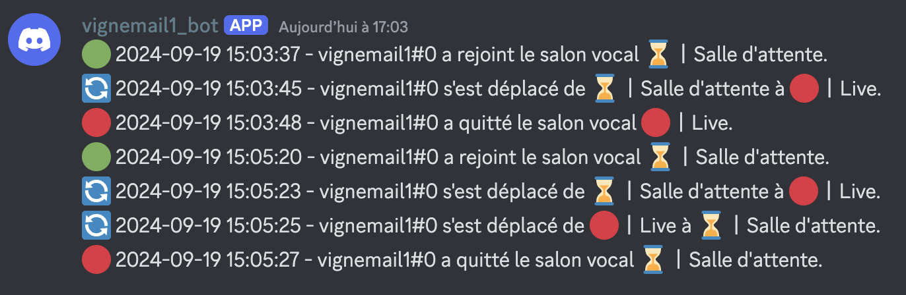

# Bot Discord de Traçage d'Activité

Ce projet est un bot Discord écrit en Python qui trace les arrivées et départs des membres d'un serveur ainsi que leurs mouvements dans les salons vocaux. Le bot enregistre les logs dans un salon textuel du serveur et dans un fichier local.



## Prérequis

- Python 3.10+

Docker peut être utiliser pour éviter les conflits ou de mettre trop de bazar sur son ordinateur. C'est d'ailleurs cette méthode qui sera décrite.

### Installation de Docker

#### Windows

1. Suivez les instructions officielles pour installer Docker Desktop pour Windows : [Documentation Docker - Windows](https://docs.docker.com/desktop/install/windows-install/).
2. Docker nécessite l'activation de WSL 2 sur Windows. Suivez les instructions de [Microsoft](https://docs.microsoft.com/fr-fr/windows/wsl/install).

#### macOS

1. Suivez les instructions officielles pour installer Docker Desktop pour macOS : [Documentation Docker - macOS](https://docs.docker.com/desktop/install/mac-install/).

#### Linux

Pour Debian/Ubuntu :

1. Suivez les instructions officielles pour installer Docker sur Linux : [Documentation Docker - Linux](https://docs.docker.com/engine/install/ubuntu/).

### Installation de Docker Compose

Sur **Windows** et **macOS**, Docker Compose est inclus avec Docker Desktop.

Pour **Linux** :

1. Suivez les instructions officielles pour installer Docker Compose : [Documentation Docker Compose](https://docs.docker.com/compose/install/).

### Vérification de l'installation

Vérifiez l'installation de Docker Compose en exécutant cette commande :

```bash
docker compose version
```

### Créer un application Discord

1. Allez sur [Discord Developer Portal](https://discord.com/developers/applications).
2. Cliquez sur **New Application**.
3. Donnez un nom à votre application.
4. Dans l'onglet **Bot**, cliquez sur **Add Bot** pour créer un bot.
5. Sous Token, cliquez sur **Copy** pour obtenir le token d'authentification du bot. Ce token sera utilisé pour connecter votre bot à Discord.

### Configuration des Variables d'Environnement

1. Recopiez le fichier `.env.dist` en `.env`.
2. Ouvrez le fichier `.env` et remplacez les valeurs par vos propres informations :
    - `DISCORD_TOKEN` : Le token de votre bot Discord (obtenu via le portal Developper).
    - `LOG_CHANNEL_NAME` : Le nom du salon textuel où les logs seront envoyés sur Discord.

**Exemple de fichier `.env`** :

```ini
DISCORD_TOKEN=TON_BOT_TOKEN
LOG_CHANNEL_NAME=le-nom-du-salon-log
```

### Lancer le Projet avec Docker Compose

Construisez et démarrez le conteneur Docker en exécutant la commande suivante dans le terminal :

```bash
docker-compose up --build -d
```

Pour arrêter les conteneurs, exécutez :

```bash
docker-compose down
```

### Fichier de Log Local

Les événements de votre bot sont également enregistrés dans un fichier de log local. Le fichier de log est situé à la racine du projet sous le nom de `bot_log.txt`. Il est monté depuis le conteneur Docker, et vous pouvez y accéder directement depuis votre système.

Bonne utilisation du bot !
